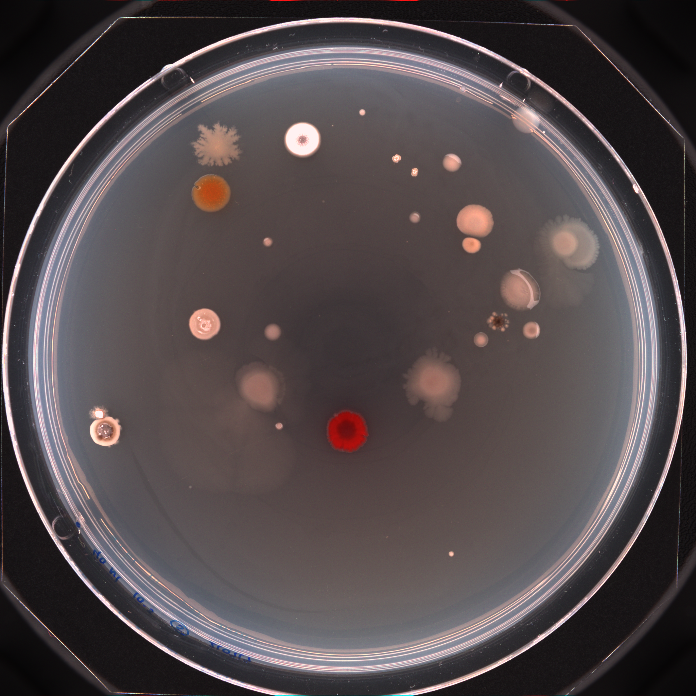
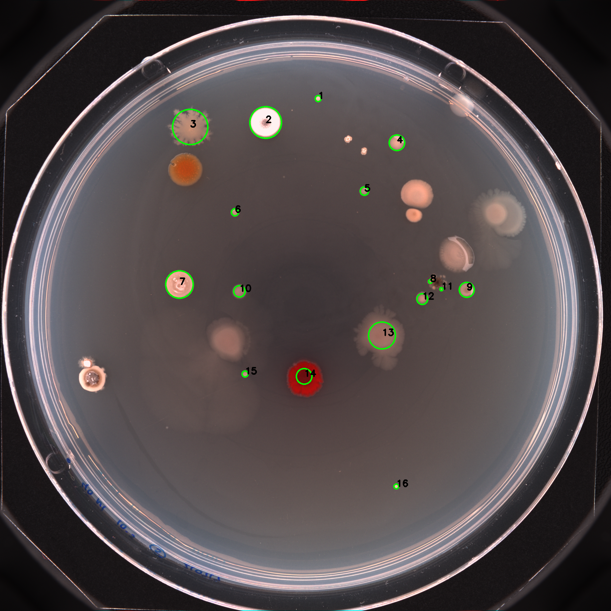
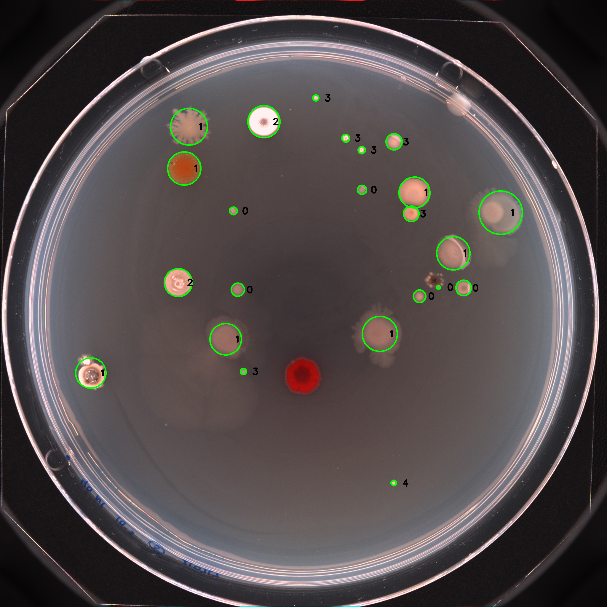

# ColFeatures

ColFeatures is a software that allows bacteria colony identification, data extraction and classification/clustering.

Upload an image like the following:

The identification output looks like this:

Optionally, K-means clustering can be preformed on colony metrics, or on only the color channels. 

The classification/clustering output looks like this:

The .csv file(s) created contains the following information: unique_label,label,centroid-0,centroid-1,area,perimeter,equivalent_diameter,eccentricity,convex_area,mean_intensity-R,mean_intensity-G,mean_intensity-B, cluster_n.

## commandline options

'''
usage: ID_colonies.py [-h] [--file FILE] [--background FILE] [--outdir OUTDIR]
                      [--outbasename NAME] [--cluster CLUSTER] [--color]

options:
  -h, --help          show this help message and exit
  --file FILE         filename of image
  --background FILE   filename of background image for subtraction
  --outdir OUTDIR     directory for output files, or else saved to current dir
  --outbasename NAME  base name for output files, otherwise the input basename
  --cluster CLUSTER   integer value of clusters to be use with Kmeans to cluster the data
  --color             only use color channels in clustering
'''

## Instalation and dependences using Conda

The following example is on a linux OS, others OSs should be similer

1. Install Conda for your OS and open a shell where you have acess to the mamba (or conda) package manager as well as git, and navigate to where you want to store this code.

2. Get code

       git clone https://github.com/danielaags/ColFeatures.git
       cd ColFeatures/python

3. Set up dependences

   Do ONE of the following:

   make an environment with the exact same versions as when the code was last updated:

       conda env create -f environment.yml
       
   OR make a container with the latest versions and save a new yaml file:

       mamba create -n ColFeatures -y numpy pandas matplotlib scikit-image scipy scikit-learn opencv
       conda env export -n ColFeatures --from-history > environment.yml

4. Activate env and run testcase

       mamba activate ColFeatures
       python3 ./ID_colonies.py  --file example/input.png --cluster 5 --outdir output --outbasename None

   Output should be the same as in the `example` subdirectory, takes 20 seconds on a decent circa 2023 laptop. 

